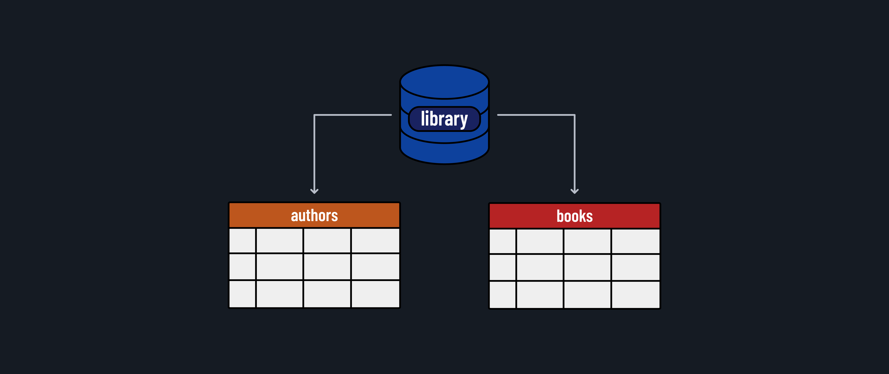

<h1>
  <span class="headline">Intro to PostgreSQL</span>
  <span class="subhead">Creating Databases and Tables</span>
</h1>

**Learning objective:** By the end of this lesson, students will be able to create a new PostgreSQL database and define tables to store structured data effectively.

## Creating a Database

During this lesson, we will use the PostgreSQL command-line tool - `psql`.

Now that we understand SQL and relational databases, let's create a new database to store book-related data. We will start with a database called `library` with tables for `books` and `authors`.



Once in the PostgreSQL command-line tool, you can create a new database using the `CREATE DATABASE` command. 

Let's create a database called `library`.

```postgres
CREATE DATABASE library; -- Remember the semicolon!
```

> 💡 Comments in SQL begin with `--`.

Confirm that you've successfully created the database with this command:

```postgres
\l
```

Using `\l`, you can list all the databases in your PostgreSQL server. You should see the `library` database listed.

> Hit the `q` key to exit the list view.

Before creating a new table in the `library` database, we must connect to it. You can connect to a database using the `\c` command followed by the name of the database:

```postgres
\c library -- connect to the library database
```

The prompt should change to `library=#`, indicating you are now connected to the `library` database.

## Creating a Table

With our database set up, the next step is to create tables to organize and store specific data. We'll start by creating a `books` table, which will hold information about various books.

Our `books` table will have four columns: `id`, `title`, `published_year`, and `author_id`.

| Column Name    | Data Type | Constraints            | Notes                                                                                                                 |
| -------------- | --------- | ---------------------- | --------------------------------------------------------------------------------------------------------------------- |
| id             | SERIAL    | PRIMARY KEY            | A unique identifier for each book. The SERIAL data type automatically generates an incremental number for each entry. |
| title          | VARCHAR   | NOT NULL               | The title of the book. The NOT NULL constraint ensures that every book entry must have a title.                       |
| published_year | INTEGER   |                        | The year the book was published.                                                                                      |
| author_id      | INTEGER   | REFERENCES authors(id) | Links to the `authors` table to establish a relationship between books and their authors.                             |

To create this table in PostgreSQL, we use the `CREATE TABLE` command:

```postgres
CREATE TABLE books (
  id SERIAL PRIMARY KEY,
  title VARCHAR NOT NULL,
  published_year INTEGER,
  author_id INTEGER REFERENCES authors(id)
);
```

> 💡 Inside the parentheses, we define the columns and their respective settings, such as data types and constraints.

Now let's create the `authors` table to store information about book authors.

```postgres
CREATE TABLE authors (
  id SERIAL PRIMARY KEY,
  name VARCHAR NOT NULL,
  nationality VARCHAR
);
```

After creating the tables, it's good practice to check that they have been set up correctly. You can list all the tables in your `library` database using the command `\dt`. If the `books` and `authors` tables have been created successfully, they will appear in the list output after running this command.

```postresql
library=# \dt

             List of relations
 Schema |  Name   | Type  |  Owner
--------+---------+-------+---------
 public | authors | table | postgres
 public | books   | table | postgres
(2 rows)
```

- Schema: By default, PostgreSQL places new tables in the public schema.
- Name: The names of the tables, authors and books, that were created.
- Type: The type of relation (both are table).
- Owner: The user who created the tables (in this case, postgres, or it will match your PostgreSQL username).

> Hit the `q` key to exit the list view.
