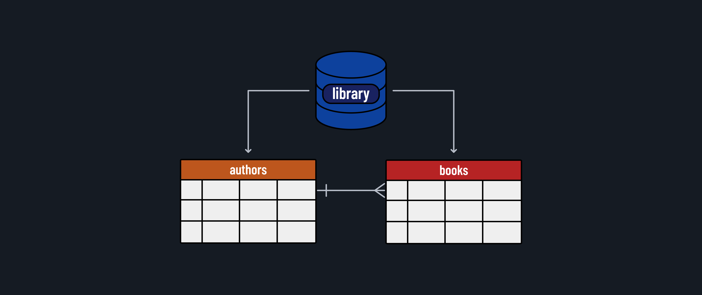

<h1>
  <span class="headline">Intro to PostgreSQL</span>
  <span class="subhead">Relating and Querying Data</span>
</h1>

**Learning objective:** By the end of this lesson, students will be able to understand and implement one-to-many relationships in SQL databases, using SQL operators to perform advanced filtering and comparisons.

## One-to-Many Relationships in SQL

We currently have a `books` table that stores information about different books. Each book is written by one author, but each author can have multiple books. This relationship is known as a **one-to-many** relationship. We can think through this relationship as:

**One _author_ has many _books_, and**  
**One _book_ belongs to an _author_**

To represent this relationship, our `books` table includes a **_foreign key_** referencing the `authors` table.



### Add more records

Now, let's insert some more book records and their respective authors:

```postgres
-- Insert books
INSERT INTO books (title, published_year, author_id)
VALUES
('The Great Gatsby', 1925, 5),
('One Hundred Years of Solitude', 1967, 6),
('Crime and Punishment', 1866, 7),
('The Little Prince', 1943, 8);


-- Insert authors
INSERT INTO authors (id, name, nationality)
VALUES
(5, 'F. Scott Fitzgerald', 'American'),
(6, 'Gabriel García Márquez', 'Colombian'),
(7, 'Fyodor Dostoevsky', 'Russian'),
(8, 'Antoine de Saint-Exupéry', 'French');
```

Now our two tables should look like this in `psql`:

```postgresql
| id  | title                              | published_year | author_id |
| --- | ---------------------------------- | -------------- | --------- |
| 1   | Pride and Prejudice                | 1813           | 1         |
| 2   | To Kill a Mockingbird              | 1960           | 2         |
| 3   | 1984                               | 1949           | 3         |
| 4   | The Alchemist                      | 1988           | 4         |
| 5   | The Great Gatsby                   | 1925           | 5         |
| 6   | One Hundred Years of Solitude      | 1967           | 6         |
| 7   | Crime and Punishment               | 1866           | 7         |
| 8   | The Little Prince                  | 1943           | 8         |
```

```postgresql
| id  | name                        | nationality  |
| --- | --------------------------- | ------------ |
| 1   | Jane Austen                 | British      |
| 2   | Harper Lee                  | American     |
| 3   | George Orwell               | British      |
| 4   | Paulo Coelho                | Brazilian    |
| 5   | F. Scott Fitzgerald         | American     |
| 6   | Gabriel García Márquez      | Colombian    |
| 7   | Fyodor Dostoevsky           | Russian      |
| 8   | Antoine de Saint-Exupéry    | French       |
```

## Querying Data

After adding to our `books` and `authors` tables, lets practice more SQL queries to extract useful information.

### Using the `WHERE` clause with operators

The `WHERE` clause is the most common for filtering query results.

Example:

```postgres
-- Query authors who are British
SELECT name FROM authors WHERE nationality = 'British';
```

Output:

```
        name
----------------------
 Jane Austen
 George Orwell
(2 rows)
```

### Using Operators

You can also use various operators in the condition, such as:

- `=`: Equal to
- `<>` or `!=`: Not equal to
- `>`: Greater than
- `<`: Less than
- `>=`: Greater than or equal to
- `<=`: Less than or equal to
- `BETWEEN`: Between an inclusive range
- `LIKE`: Search for a pattern
- `IN`: Matches any of a list of values
- `IS NULL`: Checks for `NULL` values
- `AND`: Combines multiple conditions
- `OR`: Returns rows that meet either condition
- `NOT`: Negates a condition

Let's practice with some of these operators:

```postgres
-- Query authors whose names start with 'G'
SELECT name FROM authors WHERE name LIKE 'G%';

-- Query authors who are not British
SELECT name FROM authors WHERE nationality <> 'British';

-- Query authors whose names contain the letter 'e'
SELECT name FROM authors WHERE name LIKE '%e%';

-- Query authors who are either Brazilian or Columbian
SELECT name FROM authors WHERE nationality IN ('Brazilian', 'Columbian');
```

## Using `JOIN` in SQL

In a relational database, data is often spread across multiple tables, and querying related data requires using the `JOIN` operation. A **JOIN** allows us to combine rows from two or more tables based on a related column between them, such as a foreign key.

**Use cases for `JOIN`**

Imagine you want to see the title of a book along with its author’s name. The book's title is stored in the `books` table, and the author's name is stored in the `authors` table. Since the `books` table only contains an `author_id` column, we need to use a `JOIN` to connect the two tables and retrieve complete information.

**How `JOIN` works**

A `JOIN` works by comparing a column in one table (ex: `books.author_id`) with a column in another table (ex: `authors.id`). The database matches rows from both tables where these values are equal.

### Example: Retrieve authors and their books

If you only want a simple table view with an `author` name and `title`, a join can give you this data easily, without any unneeded columns.

```postgres
SELECT authors.name AS author, books.title
FROM authors
JOIN books ON authors.id = books.author_id;
```

Output:

```
       author             |       title
--------------------------+-----------------
 Jane Austen              | Pride and Prejudice
 Harper Lee               | To Kill a Mockingbird
 George Orwell            | 1984
 Paulo Coelho             | The Alchemist
 F. Scott Fitzgerald      | The Great Gatsby
 Gabriel García Márquez   | One Hundred Years of Solitude
 Fyodor Dostoevsky        | Crime and Punishment
 Antoine de Saint-Exupéry | The Little Prince
(8 rows)
```

We can even refine this query further with additional parameters:

```postgres
-- Query authors who have written books published before 1950

SELECT authors.name, books.title, books.published_year
FROM authors
JOIN books ON authors.id = books.author_id
WHERE books.published_year < 1950;
```

Output:

```
          author          |       title            | published_year
--------------------------+------------------------+---------------
 Jane Austen              | Pride and Prejudice    | 1813
 George Orwell            | 1984                   | 1949
 F. Scott Fitzgerald      | The Great Gatsby       | 1925
 Antoine de Saint-Exupéry | The Little Prince      | 1943
(4 rows)
```

## Types of `JOIN`s in SQL

- **`INNER JOIN`**: Returns rows where there is a match in both tables.
- **`LEFT JOIN`**: Returns all rows from the left table and matched rows from the right table; unmatched rows return `NULL`.
- **`RIGHT JOIN`**: Returns all rows from the right table and matched rows from the left table; unmatched rows return `NULL`.
- **`FULL JOIN`**: Returns rows when there is a match in at least one table.

Example using `LEFT JOIN`:

```postgres
SELECT authors.name, books.title
FROM authors
LEFT JOIN books ON authors.id = books.author_id;
```

Output:

```
          name            |          title
--------------------------+------------------------
 Jane Austen              | Pride and Prejudice
 Harper Lee               | To Kill a Mockingbird
 George Orwell            | 1984
 Paulo Coelho             | The Alchemist
 F. Scott Fitzgerald      | The Great Gatsby
 Gabriel García Márquez   | One Hundred Years of Solitude
 Fyodor Dostoevsky        | Crime and Punishment
 Antoine de Saint-Exupéry | The Little Prince
(8 rows)
```

Joins are a powerful SQL feature that allow you to retrieve and analyze related data from multiple tables, making it easier to explore complex relationships within a database.
